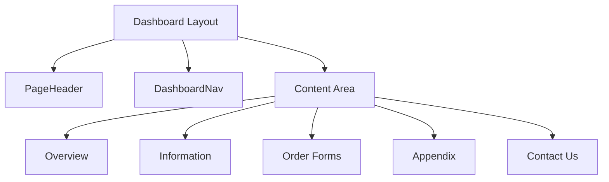

# AMSC 2025 Exhibitor Manual Website - Architecture Documentation

## Project Structure

```
amsc-2025-last/
├── src/
│   ├── app/                    # Next.js App Router pages
│   │   ├── (auth)/            # Authentication-related routes
│   │   │   ├── login/         # Login page
│   │   │   │   ├── page.tsx   # Login page component
│   │   │   │   └── LoginForm.tsx  # Login form component
│   │   │   └── layout.tsx     # Auth layout with provider
│   │   ├── dashboard/         # Dashboard routes
│   │   │   ├── information/   # Information sections
│   │   │   ├── order-forms/   # Order form pages
│   │   │   ├── appendix/      # Appendix content
│   │   │   ├── contact-us/    # Contact information
│   │   │   └── layout.tsx     # Dashboard layout
│   │   ├── layout.tsx         # Root layout with providers
│   │   └── page.tsx           # Root page (redirects to login)
│   ├── components/            # Reusable React components
│   │   ├── auth/             # Authentication components
│   │   │   ├── AuthProvider.tsx  # Auth state management
│   │   │   └── LoginForm.tsx     # Login form with validation
│   │   ├── forms/            # Form components
│   │   ├── layout/           # Layout components
│   │   └── ui/               # UI components
│   ├── lib/                  # Utility functions and configurations
│   │   ├── supabase/        # Supabase client and helpers
│   │   │   ├── config.ts    # Supabase client configuration
│   │   │   └── schema.sql   # Database schema definition
│   │   ├── constants.ts     # Constants and configurations
│   │   └── utils.ts         # Utility functions
│   ├── types/               # TypeScript type definitions
│   └── styles/              # Global styles and Tailwind config
├── public/                  # Static assets
├── docs/                    # Documentation
│   ├── progress.md         # Implementation progress
│   └── architecture.md     # Architecture documentation
└── Memory Bank/            # Project requirements and specifications
```

## Technology Stack

### Frontend
- Next.js 14.1.0 with App Router
- React 18.2.0
- TypeScript 5.3.3
- Tailwind CSS 3.4.1
- React Hook Form with Zod validation

### Backend & Database
- Supabase Auth Helpers
- Supabase Database
- Row Level Security (RLS)
- PostgreSQL with JSONB support

## Database Schema

### 1. Users Table (`amsc_2025_user`)
```sql
CREATE TABLE amsc_2025_user (
  id UUID PRIMARY KEY,
  company_name TEXT NOT NULL,
  contact_person TEXT NOT NULL,
  address TEXT NOT NULL,
  booth_number TEXT NOT NULL,
  telephone TEXT NOT NULL,
  fax TEXT,
  email TEXT NOT NULL UNIQUE,
  created_at TIMESTAMP WITH TIME ZONE
);
```
- Links to Supabase Auth users
- RLS enabled: Users can only view their own data
- Stores company and contact information

### 2. Form Submissions (`form_submissions`)
```sql
CREATE TABLE form_submissions (
  id UUID PRIMARY KEY,
  user_id UUID NOT NULL,
  form_type INTEGER NOT NULL,
  company_data JSONB NOT NULL,
  items JSONB NOT NULL,
  subtotal DECIMAL(10,2) NOT NULL,
  late_charge DECIMAL(10,2) NOT NULL,
  grand_total DECIMAL(10,2) NOT NULL,
  submitted_at TIMESTAMP WITH TIME ZONE,
  payment_details JSONB NOT NULL,
  authorization JSONB NOT NULL,
  UNIQUE(user_id, form_type)
);
```
- Stores all form submissions
- One submission per form type per user
- JSON fields for flexible data structure
- RLS enabled: Users can view and create their own submissions

### 3. Form Configurations (`form_configs`)
```sql
CREATE TABLE form_configs (
  id INTEGER PRIMARY KEY,
  name TEXT NOT NULL,
  late_charge_type TEXT NOT NULL,
  late_charge_value DECIMAL(10,2) NOT NULL,
  deadline TIMESTAMP WITH TIME ZONE NOT NULL,
  items JSONB NOT NULL
);
```
- Stores form metadata and configurations
- Manages late charge rules and deadlines
- RLS enabled: All authenticated users can read

## Authentication Implementation

### Components
1. **AuthProvider (`components/auth/AuthProvider.tsx`)**
   - Manages auth state using Supabase
   - Provides session context
   - Handles auth state changes
   - Implements auto-refresh for sessions

2. **LoginForm (`components/auth/LoginForm.tsx`)**
   - Email/password authentication
   - Form validation using Zod
   - Error handling and feedback
   - Responsive design with Tailwind CSS

3. **Middleware (`middleware.ts`)**
   - Route protection
   - Session validation
   - Redirect logic for unauthenticated users
   - Refresh token handling

### Authentication Flow
1. **Login Process**
   ```mermaid
   graph TD
     A[User enters credentials] --> B[Validate with Zod]
     B --> C{Valid?}
     C -->|Yes| D[Submit to Supabase]
     C -->|No| E[Show form errors]
     D --> F{Success?}
     F -->|Yes| G[Store session]
     F -->|No| H[Show auth error]
     G --> I[Redirect to dashboard]
   ```

## Form Submission Flow

1. **Form Loading**
   - Load form configuration from `form_configs`
   - Pre-fill company data from `amsc_2025_user`
   - Check submission status

2. **Submission Process**
   - Validate form data
   - Calculate totals and late charges
   - Store in `form_submissions`
   - Generate PDF
   - Send email notification

3. **Late Charge Rules**
   - No late charges: Forms 1, 6, 7, 8
   - Lump sum (RM 100): Form 2
   - Percentage based:
     - 10%: Form 3
     - 30%: Forms 4, 5

## Security Implementation

1. **Row Level Security (RLS)**
   ```sql
   -- User data access
   CREATE POLICY "Users can view own data"
     ON amsc_2025_user
     FOR SELECT
     USING (auth.uid() = id);

   -- Form submission access
   CREATE POLICY "Users can view own submissions"
     ON form_submissions
     FOR SELECT
     USING (auth.uid() = user_id);
   ```

2. **Environment Variables**
   ```env
   NEXT_PUBLIC_SUPABASE_URL=your-project-url
   NEXT_PUBLIC_SUPABASE_ANON_KEY=your-anon-key
   EMAIL_FROM=noreply@example.com
   EMAIL_ADMIN_TO=daniel@bcpgroup.com.my
   ```

## Development Guidelines

1. **TypeScript Types**
   - Strong typing for database schema
   - Type-safe form handling
   - Shared types between client and server

2. **Component Structure**
   - Server Components by default
   - Client Components for interactive elements
   - Shared UI components in `/components/ui`

3. **Form Handling**
   - React Hook Form for form state
   - Zod for validation
   - Real-time calculations
   - PDF generation on submission

4. **State Management**
   - Server state via Server Components
   - Form state via React Hook Form
   - Global state via Context API
   - Authentication state via Supabase 

## Dashboard Architecture

### Components

1. **DashboardLayout (`app/dashboard/layout.tsx`)**
   - Protected route wrapper
   - Session validation
   - Layout structure with sidebar
   - Responsive design

2. **PageHeader (`components/dashboard/PageHeader.tsx`)**
   - Top navigation bar
   - Logo and branding
   - Sign-out functionality
   - Company name display

3. **DashboardNav (`components/dashboard/DashboardNav.tsx`)**
   - Sidebar navigation
   - Route management
   - Active state handling
   - Navigation items:
     - Overview
     - Information
     - Order Forms
     - Appendix
     - Contact Us

4. **Dashboard Overview (`app/dashboard/page.tsx`)**
   - User profile display
   - Company information cards
   - Dynamic data fetching
   - Status overview

### Navigation Flow


### Utility Functions

1. **Class Name Handling (`lib/utils.ts`)**
   ```typescript
   import { type ClassValue, clsx } from 'clsx'
   import { twMerge } from 'tailwind-merge'

   export function cn(...inputs: ClassValue[]) {
     return twMerge(clsx(inputs))
   }
   ```
   - Combines Tailwind classes
   - Handles conditional styling
   - Merges class names efficiently

### Protected Routes Implementation

1. **Session Validation**
   ```typescript
   const supabase = createServerComponentClient({ cookies })
   const { data: { session } } = await supabase.auth.getSession()

   if (!session) {
     redirect('/login')
   }
   ```

2. **Layout Protection**
   - Server-side authentication check
   - Client-side navigation guard
   - Session persistence 